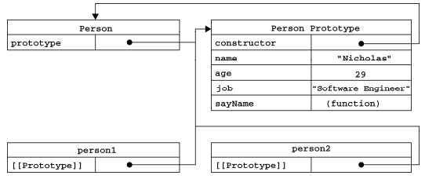
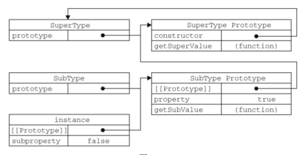

### JavaScript面对对象

ECMA-262把对象定义为："无序属性的集合，其属性可以包含基本知识、对象或者函数。"严格的
讲，这就相当于说**对象是一组没有特定顺序的值。对象的每个属性或方法都有一个名字，每个名字都映射到一个值。**

---

#### 理解对象

```javascript
var person = new Object();
person.name = "Nicholas";
person.age = 25;
person.job = "Software Engineer";
person.sayName = function() {
    alert(this.name);
}
```

----

使用对象字面量语法可以写成这样：

```javascript
var person = {
    name: "Nicholas",
    age: 25,
    job: "Software Engineer";
    sayName: function() {
        alert(this.name);
    }
}
```

----

#### 属性类型

只有在内部采用的特性（`attribute`）。

* **[[ Configurable ]]** : 表示能否通过delete删除属性从而重新定义属性，能否修改属性的特性，或者能否把属性修改为访问器属性。默认为 true
* **[[ Enumerable ]]** : 表示能否通过 `for-in` 循环返回属性。默认为 true
* **[[ Writable ]]** : 表示能否修改属性的值。默认为 true
* **[[ Value ]]** : 包含这个特属性的数据值。读取数据值时，从这个位置读；写入属性值的时候，把新值保存在这个位置。这个特性的默认值为 undefined

----

例如：

```javascript
var person = {
    name: "Nicholas"
}
```

----

要修改属性的默认特性，必须使用 `ES5` 的`Object.defineProperty()` 方法。这个方法接收三个参数：属性所在的对象，属性的名字和一个描述符对象。

```javascript
var person = {};
Object.defineProperty(person, "name", {
    writable: false, // 只读属性
    value: "Nicholas"
});
alert(person.name); // "Nicholas"
person.name = "Greg";
alert(person.name); // "Nicholas"
```

----


类似的规则也适用于不可配置的属性。例如：

```javascript
var person = {};
Object.defineProperty(person, "name", {
    configurable: false, // 不能从对象中删除的属性
    value: "Nicholas"
});
alert(person.name); // "Nicholas"
delete person.name;
alert(person.name); // "Nicholas"
```

----


**在调用`Object.defineProperty()` 方法时，如果不指定，configurable、enumerable 和 writable特性的默认值都是false。**

----

#### 访问器属性
* **[[Configurable]]** : 表示能否通过 `delete` 删除属性从而重新定义属性，能否修改属性的特性，或者能否把属性修改为数据属性。 默认为 true
* **[[Enumerable]]** : 表示能否通过 `for-in` 循环返回属性。对于直接在对象上定义的属性，这个特性的默认值为 true
* **[[Get]]** : 在读取属性时调用的函数。默认值为 undefined。
* **[[Set]]** : 在写入属性时调用的函数。默认值为 undefined。

----

访问器属性不能直接定义，必须使用 `Object.defineProperty()` 来定义。

```javascript
var book = {
    _year: 2004,
    edition: 1
};
Object.defineProperty(book, "year", {
    get: function() {
        return this._year;
    },
    set: function(newValue) {
        if(newValue > 2004) {
            this._year = newValue;
            this.edition += newValue - 2004;
        }
    }
});
book.year = 2005;
alert(book.edition); // 2
```

----

#### 定义多个属性

```javascript
var book = {};
Object.defineProperties(book, {
  _year: {
    value: 2004
  },
  edition: {
    value: 1
  },
  year: {
    get: function () {
      return this._year;
    },
    set: function (newVal) {
      if (newVal > 2004) {
        this._year = newVal;
        this.edition += newVal - 2004;
      }
    }
  }
})
```

----

#### 读取属性的特性

```javascript
var book = {};
Object.defineProperties(book, {
  _year: {
    value: 2004
  },
  edition: {
    value: 1
  },
  year: {
    get: function () {
      return this._year;
    },
    set: function (newVal) {
      if (newVal > 2004) {
        this._year = newVal;
        this.edition += newVal - 2004;
      }
    }
  }
})
var descriptor = Object.getOwnPropertyDescriptor(book, "year");
console.log(descriptor);
console.log(descriptor.enumerable); // false
```

---


### 创建对象

#### 工厂模式


```javascript
function createPerson(name, age, job) {
    var o = new Object();
    o.name = name;
    o.age = age;
    o.job = job;
    o.sayName = function() {
        alert(this.name);
    }
    return o;
}
```

----

#### 构造函数模式

```javascript
function Person(name, age, job) {
  this.name = name;
  this.age = age;
  this.job = job;
  this.sayName = function () {
    console.log(this.name);
  }
}
var p1 = new Person("Nicholas", 19, "Software Engineer");
var p2 = new Person("Greg", 20, "Tester");
console.log(p1.constructor === p2.constructor);
```

----

要创建Person的实例，必须使用new操作符。以这种方式调用构造函数实际上会经历以下4个步骤：

	* 创建一个新对象；
	* 将构造函数的作用域赋给新对象（因此this就指向了这个新对象）；
	* 执行构造函数中的代码（为这个新对象添加属性）；
	* 返回新对象。

----

p1 和 p2分别保存着 Person的一个不同的实例。这两个对象都有一个constructor属性，该属性指向 Person。使用构造函数的方式意味着可以将他的实例标示为一种特定的类型。

```javascript
console.log(p1 instanceof Person); // true
console.log(p1 instanceof Object); // true
```

----

构造函数的问题
```javascript
var sayName = function () {
  console.log(this.name);
}
function Person(name, age, job) {
  this.name = name;
  this.age = age;
  this.job = job;
  this.sayName = sayName;
}
var p1 = new Person("Nicholas", 19, "Software Engineer");
p1.sayName();
```

----

#### 原型模式

```javascript
function Person() { }
Person.prototype.name = "Nicholas";
Person.prototype.age = 19;
Person.prototype.sayName = function () {
  console.log(this.name);
}
```

----

理解对象原型



----

```javascript
Object.getPrototypeOf(P1) === Person.prototype
```

----

如果我们在实例中添加了一个属性，而该属性与实例原型中的一个属性同名，那我们就在实例中创建该属性，该属性将会屏蔽原型中的那个属性。

```javascript
function Person() { }
Person.prototype.name = "Nicholas";

var p1 = new Person();
var p2 = new Person();
p1.name = "Greg";
console.log(p1.name); // "Greg"
console.log(p2.name); // "Nicholas"
```

----

原型与in操作符

有两种方式使用 in 操作符：单独使用和在 `for-in` 循环中使用。在单独使用时，in 操作符会在通过对象能够访问给定属性时返回 true ，无论该属性是在实例中还是原型中。

```javascript
var o = {
  toString: function () {
    return "My Object";
  }
}
for (var prop in o) {
  if (prop == "toString") {
    alert("Found toString");
  }
}
```

----

要取得对象上所有可枚举的实例属性，可以使用ES5的 `Object.keys()` 方法。

```javascript
function Person() { }
Person.prototype.name = "Nicholas";
Person.prototype.age = 23;
Person.prototype.sayName = function () {
  alert(this.name);
}
var keys = Object.keys(Person.prototype);
console.log(keys);

var p1 = new Person();
p1.name = "Greg";
p1.age = 24;
var p1Keys = Object.keys(p1);
console.log(p1Keys);
```

----

如果重写整个原型对象，那么情况不一样了。
```javascript
function Person() { }
var friend = new Person();
Person.prototyp = {
  constructor: Person,
  name: "Nicholas",
  age: 12,
  job: "Software Engineer",
  sayName: function () {
    alert(this.name);
  }
}
friend.sayName(); // error
```

----

#### 组合使用构造函数模式和原型模式

```javascript
function Person(name, age, job) {
  this.name = name;
  this.age = age;
  this.job = job;
  this.friends = ["Tom", "Jerry"];
}
Person.prototype = {
  constructor: Person,
  sayName: function () {
    console.log(this.name)
  }
}
var p1 = new Person("Nicholas", 23, "Software");
var p2 = new Person("Greg", 28, "Doctor");

console.log(p1.friends === p2.friends); // false
console.log(p1.sayName === p2.sayName); // true
```

----

#### 动态原型模式

```javascript
function Person(name, age, job) {
    this.name = name;
    this.age = age;
    this.job = job;
    if(typeof this.sayName != "function"){
        Person.prototype.sayName = function() {
            console.log(this.name)
        }
    }
}
```

----

### 寄生构造函数模式

```javascript
function Person(name, age, job) {
  var o = new Object();
  o.name = name;
  o.age = age;
  o.job = job;
  o.sayName = function () {
    console.log(this.name);
  }
  return o;
}
var friend = new Person("Nicholas", 21, "Software Engineer")
```

----

#### 稳妥构造函数模式

稳妥对象，指的是没有公共属性，而且其他方法也不引用this的对象。

```javascript
function Person(name, age, job) {
  var o = new Object();
  o.sayName = function () {
    alert(name);
  }
  return o;
}
```

---

### 继承

继承是OO语言中一个最为人津津乐道的概念。许多OO语言都支持两种继承方式：接口继承和实现继承。接口继承只继承方法签名，而实现继承则继承实际的方法。

原型链作为实现继承的主要方法，基本思想是利用原型让一个引用类型继承另一个引用类型的属性和方法

----

#### 原型链

每个构造函数都有一个原型对象，原型对象包含一个指向构造函数的指针（constructor），而实例包含一个指向原型对象的内部指针（`__proto__`）。**如果让原型对象等于另一个类型的实例，此时的原型对象将包含另一个原型的指针，相应的，另一个原型中也包含着另一个构造函数的指针。如此层层递进，就构成了实例与原型的链条。这就是所谓的原型链的基本概念。**

----

```javascript
function SuperType() {
  this.property = true;
}
SuperType.prototype.getSuperValue = function () {
  return this.property;
}
function subType() {
  this.subproperty = false;
}
// 继承了SuperType
subType.prototype = new SuperType();
subType.prototype.getSubValue = function () {
  return this.subproperty;
}
var instance = new subType();
console.log(instance.getSuperValue()); // true
```

----



----


> 注意：通过原型链实现继承时，不能使用对象字面量创建原型方法。因为这样会重写原型链。

```javascript
function SuperType() {
  this.property = true;
}
SuperType.prototype.getSuperValue = function() {
  return htis.property;
}

function SubType() {
  this.subProperty = false;
}
SubType.prototype = new SuperType(); // 子类 继承了 父类
SubType.prototype = { // prototype 是引用类型，使用字面量的方式重新赋值后，会切换和原先父类的联系
  getSubValue: function() {
    return this.subproperty;
  }
}
```

----

#### 型链的问题

1. 原型链会包含引用类型值的原型。

```javascript 
function SuperType() {
  this.colors = ["red", "blue", "green"];
}
function SubType(){
	// some properties  
}
SubType.prototype = new SuperType(); // 父类的引用值赋值给子类的protoype
var instance1 = new SubType();
instance1.colors.push("black");  // 这里直接修改了父类的属性colors，导致其他实例也会共享这种改变
console.log(instance1.colors); // ["red", "blue", "green", "black"]

var instance2 = new SubType();
console.log(instance2.colors); // ["red", "blue", "green", "black"]
```

----

2. 原型链的第二个问题是不能给超类型的构造函数中传递参数。

----

#### 组合继承

```javascript
function SuperType(name) {
  this.name = name;
  this.colors = ["red", "blue", "green"];
}
SuperType.prototype.sayName = function() {
  alert(this.name);
}
function SubType(name, age) {
  SuperType.call(this, name); // 使用 apply 也行
  this.age = age;
}
// 继承方法
SubType.prototype = new SuperType();
SubType.prototype.constructor = SubType;
SubType.prototype.sayAge = function() {
  alert(this.age);
}
```

---

#### class 继承

```javascript
class Point {
  constructor(x, y) {
    this.x = x;
    this.y = y;
  }
  toString() {
    return `${this.x} ${this.y}`;
  }
} 

var p1 = new Point(2, 4);
var p2 = new Point(3, 5);
p1.__proto__ === p2.__proto__; // p1 和 p2 的原型对象都指向了 Point.prototype。
```

----

```javascript
/* 通过class继承 */
class ColorPoint extends Point {
  constructor(x, y, color) {
    super(x, y);
    this.color = color;
  }
  toString() {
    return `${this.color} ${super.toString()}`;
  }
}
```

> 注意： 子类必须在 `constructor` 中调用 `super` 方法，不然会报错。

----

ES5 的继承，实质是先创造子类的实例对象`this`，然后再将父类的方法添加到 `this` 上面（`Parent.apply(this)` ）。ES6 的继承机制完全不同，实质是先将父类实例对象的属性和方法，加到`this`上面（所以必须先调用 `super` 方法），然后再用子类的构造函数修改 `this`。

---

### 小结

* js中的对象
* 创建对象的集中方式：
  *  工厂模式
  * 构造函数模式
  * 原型模式
* 原型实现继承
* ES6 的 class 继承